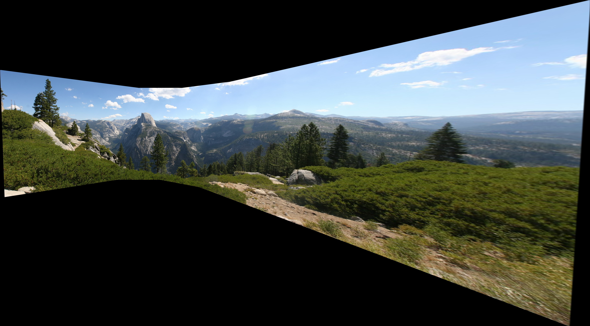
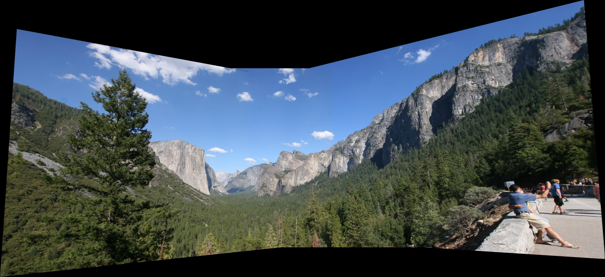
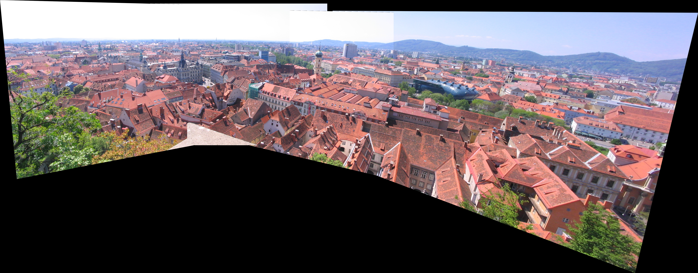

Panoramic Stitching
======

This algorithm mainly uses several pictures taken by one camera in one fixed position from different angles. These pictures can be stitched together with the Homography matrix.<br>
The `main()` function is in the `Source.cpp`. It shows how to use this function.<br>

## Construct the panoramicStitching class
```cpp
std::vector<std::pair<int, int>> image_pairs = { { 3, 0 },{ 3, 1 },{ 3, 2 } };
int base_index = 3;
panSti::panoramicStitching pan(base_index, names, image_pairs);
cv::Mat result = pan.stitch_image();
```
* First of all, we should input the image pairs as the parameter to indicate the pairs of images to calculate the homography. The first integer of the pair is the index of left image, and the second integer of the pair is the index of the right image. We compute the Homography to transfer the right image to the left image. The pair we choose should have enough overlapping area.<br>
* Then, we indicate the base image of the panorama. The base image means all other images will project to the coordinate of this image. We should choose the image at the center as the base image to prevent huge distortion.<br>

## Use sift to match the corresponing point
* Use the sift detector and descriptor to find the corresponding point in the image pairs. In order to prevent too many invalid matches, we will only consider the match whose distance is less than some threshold. The threshold is `2 * min_dist` or some constant value(0.02) if the `min_dist` is too small.<br>
```cpp
double min_dist = 100, max_dist = 0;
for (const cv::DMatch& match : matches) {
	min_dist = std::min(min_dist, double(match.distance));
	max_dist = std::max(max_dist, double(match.distance));
}
std::vector<cv::DMatch> good_matches;
for (const cv::DMatch& match : matches) {
	if (match.distance <= std::max(2 * min_dist, good_match_threshold))
		good_matches.push_back(match);
}
```

# Use DLT and RANSAC to get the intial Homography matrix
* The ransac algorithm is implemented in the `panoramicStitching::runRansac` funtion. Every time, it chooses 4 points randomly to calculate the Homography matrix with DLT. Then, use the geometric distance to determine the error. Find the Homography with max inlier points. Use these points with DLT to calculate the initial Homography matrix.<br>
* The DLT algorithm is implemented in the `panoramicStitching::runKernel` function. The normalization step should be implemented before the matrix computation.<br>

# Use L-M iteration to get the precise Homography matrix
* With the initial matrix from the DLT, we use the L-M iteration to get the more precise Homography matrix. `panoramicStitching::refine` implements this algorithm with `Eigen` library.<br>
```cpp
Eigen::VectorXd x(8);
double h8 = ini_homo.at<double>(2, 2);
for (int i = 0; i <= 7; i++) {
	x[i] = ini_homo.at<double>(i / 3, i - 3 * (i / 3)) / h8;
}
//Eigen::VectorXd x_previous = x.replicate(1, 1);
geometricError functor(left_points, right_points);
Eigen::NumericalDiff<geometricError> num_diff(functor);
Eigen::LevenbergMarquardt<Eigen::NumericalDiff<geometricError>> lm(num_diff);
int ret = lm.minimize(x);
//std::cout << x - x_previous << std::endl;
for (int i = 0; i <= 7; i++) {
	ini_homo.at<double>(i / 3, i - 3 * (i / 3)) = x[i];
}
ini_homo.at<double>(2, 2) = 1;
return ini_homo;
```

# Use the Homography matrix to stitch different images
* The stitching algorithm is implemented in `panoramicStitching::stitch_image()` function.<br>
* With the overlapping area, using the average pixel value as the result value will lead to blur. Thus, I use the pixel value of the image whose center is nearest to this point as the result pixel value.<br>
1. Calculate the Homography matrix corresponding to the base image.
2. Use 4 end-points of every image to calculate the size of the final result image.
3. Translate every image right with `abs(left_most)` and down with `abs(up_most)` to make the coordinates all greater than 0.
4. Use the `cv::warpPerspective()` to get the result image after the projection transform.
5. Iterate over all points in the image. With every point, set the corresponding pixel value of the nearest image as its value.

# Image stitching result
* Data1:<br>


* Data2:<br>


* Data3:<br>


* Data4:<br>

